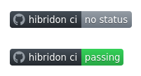

Each time Hibridon source code is modified merging a Pull Request or directly pushing to the master branch, the new source code is automatically built and tested. This continuous integration ensures that the new modifications added to the source code does not unexpectedly affect the results of Hibridon calculations.

On the main page of the [Hibridon GitHub repository](https://github.com/hibridon/hibridon/), the four labels at the top of the build instructions allow you to check if the last bunch of tests were successful (passing):

Currently, these tests are done on two different platforms (macOS and Linux), using different build modes (Release and Debug), compilers, and BLAS/LAPACK libraries.
The full list of the configurations used for the continuous integration is the following:

| Platform | OS version | Build mode | Compiler           | BLAS/LAPACK Library |
| -------- | ---------- | ---------- | ------------------ | ------------------- |
| macOS    | 11.2       | Debug      | gfortran 11        | Apple               |
| macOS    | 11.2       | Debug      | Intel ifort 2022   | Intel MKL           |
| macOS    | 11.2       | Release    | gfortran 11        | Apple               |
| macOS    | 11.2       | Release    | Intel ifort 2022   | Intel MKL           |
| Linux    | Debian 12  | Debug      | gfortran 12.2      | OpenBLAS 0.3.21     |
| Linux    | Debian 12  | Debug      | Intel ifx 2024.2.1 | Intel MKL 2024.2.1  |
| Linux    | Debian 12  | Release    | gfortran 12.2      | OpenBLAS 0.3.21     |
| Linux    | Debian 12  | Release    | Intel ifx 2024.2.1 | Intel MKL 2024.2.1  |

Tow tests suites are executed for the continuous integration:
- `Full CI`: Tests from the coverage suite are executed. Theses tests are built to be fast to execute and cover most of the Hibridon source code (see the [code coverage](https://github.com/hibridon/hibridon/discussions/215) discussion).
- `Long CI`: All the tests are executed.